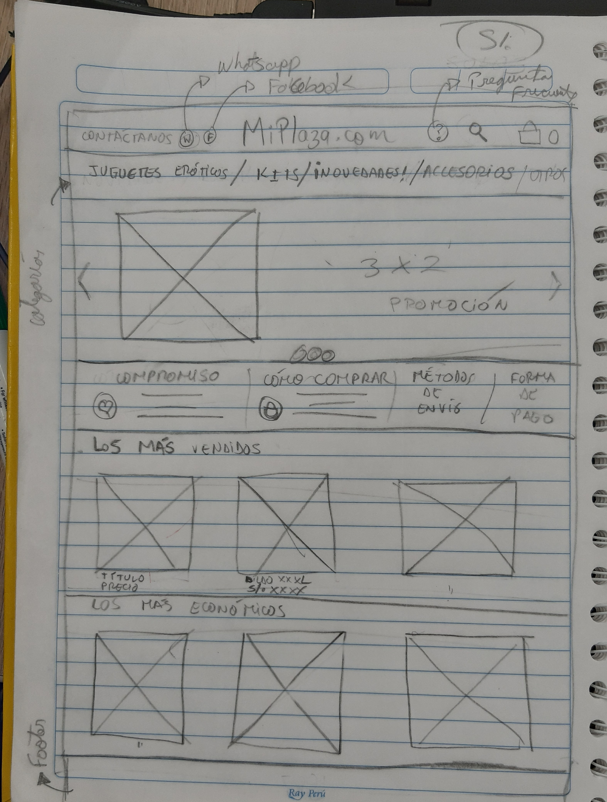

# **Plataforma de ventas en línea**

## Preámbulo

El negocio de los Sex Shops es que cada vez más rentable. En la actualidad se estima
que se percibe una ganancia de 23 600 millones de dólares a nivel mundial.
Por otro lado, remontando a la historia, el primer sex shop apareció durante la II Guerra Mundial, 
justo en un momento en el que surgió una nueva necesidad, pues había mujeres que quedaban viudas 
tras la guerra, o con problemas con sus parejas. Debido al cambio que tenían sus maridos al regresar
de la guerra, las mujeres sentían que ya no eran los mismos. La necesidad de esas mujeres era tener
acceso a una educación sexual, labor de la que se encargó la aviadora alemana Beate Uhse-Rotermund. 
En la actualidad el 60% de las mujeres siguen liderando este rubro. Así mismo, en América latina los
sex shop van a la vanguardia del Ecommerce, el comercio electrónico se fortalece cada día  y es parte 
de esta tendencia. 

# Proceso del Proyecto
Para poder generar una propuesta de valor y lograr entender cuál es la mejor forma de ofrecer los productos del cliente a sus usuarios en poco tiempo hemos tenido que conocer y entender a la empresa, el cliente, los usuarios y posibles usuarios. Para ello hemos implementado diversas herramientas y actividades características del  *Diseño Centrado en el Usuario*, las cuales vamos a presentar a continuación.

## 1) Descubrimiento e Investigación

### “Nuevo portal de e-commerce”

Actualmente, El Perú es el quinto país más emprendedor en el mundo y ocupa el primer lugar en cuanto 
al índice de espíritu emprendedor en Latinoamérica con un valor de 0,37 puntos, según el informe del Global 
Entrepreneurship Monitor (GEM). Dentro de los nuevos emprenderores, presentamos a Leslie Quispe.

 
[Entrevista a Lesli Quispe](https://drive.google.com/open?id=1AxVKs3V2Akhg7LlZw8JHJ9POM8LzVsAf) (audio)

Una mujer joven de 22 años que, a muy corta edad, 8 años,  empezó con un sueño, el cuál es crear una fundación que ayude a niños que son víctimas de violencia. Estudiaba por las mañanas y por las tardes trabajaba para lograr
alcanzar su objetivo, en el proceso entendió que tenía que duplicar sus fuerzas, es por ello que decide a los 11 años dejar la escuela regular para trabajar todo el día y conseguir más dinero a la par continúo estudiando
pero lo hacia los fines de semana en un colegio no escolarizado. Nuestra emprendedora motivada aún más con la mayoría de edad decide ganar aún más. Trabajó en dos empresas donde logro juntar más dinero, pero no satisfecha
entendió que había llegado el momento de hacer crecer todo el dinero ganado con un negocio propio, para el cual 
realizó un estudio de mercado de forma empírica, le llamo mucho la atención saber que la venta de juguetes 
para adultos en los sex shops tenía gran acogida y es así como nace [MiPlaza.com](https://www.facebook.com/MiPlaza.com1/)
### MiPlaza . com

Lesli como emprendedora sabe que el servicio de venta de dichos productos 
tiene que ser innovador y por lo tanto estar acompañado de la tecnologia actual. Es por
ello que en la actualidad se encuentra estudiando Desarrollo Web a fin de crear
su propia página web  e incrementar sus ventas.

Es en este punto donde trabajaremos con nuestra cliente: a mejorar el portal de ventas. Para el cual realizamos un estudio previo sobre lo que desea nuestra cliente y los 
usuarios consumidores. 

En este caso, Lesli vende a través de una página en Facebook y se comunica con los clientes a través de Messenger y WhatsApp. Observamos que en la pagina de Facebook tiene mucha información interesante pero que se va perdiendo conforme los post sobre los productos van aumentando, a la vez, es difícil encontrar los videos descriptivos sobre el uso de los mismos. Al entrevistar a diferentes usuarios, todos concordaban en que lo más importante para ellos es la discreción, debido a que el uso de juguetes para obtener un mayor placer sexual aún es un tema tabú en nuestra sociedad. Además, también conincidieron en que tener la informacion de los productos bien detallada es esencial. 

Todo lo antes mencionado nos llevó a crear una página web donde se pueda acceder a una información organizada, amigable al usuario y sin que pierda la esencia discreta característica de [MiPlaza.com](https://www.facebook.com/MiPlaza.com1/), generando así una experiencia única y positiva al momento de realizar una compra.

Aquí documentamos nuestra [investigación](https://drive.google.com/open?id=1f2XqnZbHn2Ep_5xqLY8KNkaOjTRBZm81n_pX8lkFLgQ)

 Aquí se pueden escuchar y ver las entrevistas realizadas:
 
 [Guía de preguntas para entrevistar](https://drive.google.com/open?id=1ycKwOORyodecfibC29M3KvQ3DKJKUubkMyekwfROcx4)

 [Entrevista a futuros usuari@s](https://drive.google.com/open?id=1nVzx-zp8dFviRDYRdi3AV2aCVCWpNLwv)
 

## 2) Síntesis

### Información obtenida:
En las entrevistas los posibles usuarios manifestaron lo siguiente:

- “Me da un poco de **vergüenza**”
- “Me da un poco de **vergüenza** que el repartidor vea lo que he comprado”
- “Sé que no es algo malo, pero me da **vergüenza**”
- “Me da **vergüenza** entrar a una de esas páginas ”

Todos los posibles usuarios concuerdan en que les da verguenza hablar sobre los juguetes para adultos. Luego se realizó el [Affinity Diagram.](https://drive.google.com/open?id=1vzc4eKx_Sg9Kz0cVp1i3Kb31bx18Cmbe)

Con la información hallada, se procedió a realizar el User Persona

                           Prudencia (36 años)

                                Ama de casa
                                   Casada
                                   Comas
        “Llevo 10 años de casada y quiero reavivar la llama del amor con mi  esposo”

Prudencia está casada desde hace 10 años, tiene 2 hijos uno de 3 y otro de 5, ama mucho a su esposo y siempre está reinventándose para que el amor se mantenga como el primer día, es por ello que pese a que se considera una mujer conservadora está dispuesta a probar nuevas sensaciones para poder pasar momentos especiales con su amado esposo

Se continuó con el [Customer Journey Map](https://drive.google.com/open?id=1LylflAV13EvuHryrtY4OPVMo6LDEtyx-)
 

Todas las herramientas nos sirvieron para lograr identificar uno de los problemas el cual fue:

Los usuarios necesitan conocer los detalles del juguete para adulto para poder elegir acertadamente el de su preferencia y no se arrepienta de su compra.

Objetivos:

Objetivo general

Crear una página web que le sirva al usuario para conocer y comprar los productos que la tienda ofrece

Objetivos específicos: 

- Visualizar la página web con los detalles de los productos.
- Identificar de manera clara los productos que se encuentran en [MiPlaza.com](https://www.facebook.com/MiPlaza.com1/)
- Visualizar los videos en los que se explica el uso de los productos.

Por lo antes mencionado, como solución se tiene lo siguiente 

Crear una página web amigable a fin de que los usuarios, puedan encontrar la descripción detallada de los productos que más les llaman la atención. incluyendo fotos y videos

## 3) Ideación
Para tener una idea visual sobre lo que terminaría siendo el prototipo final, realizamos un ejercicio llamado ***crazy 8*** que nos ayudó a gestar ideas para la futura página web.

Los pueden observar [aquí](https://drive.google.com/open?id=1da7kutpdAO9vQo-Up8PHfVVdz9oaEWht)

A continuación realizamos sketches de un primer prototipo

1er wireframe

Prototipo en baja fidelidad

 ## 4) Prototipado
Por último, se procedió a realizar el prototipo de alta fidelidad, el cual fue testeado para luego realizar mínimas modificaciones, el producto final fue:

Pueden acceder a este prototipo haciendo [click aquí](https://www.figma.com/proto/d5PIgkX7u4cQAEjh1BpHrL2f/Prototipo-de-alta-fidelidad?node-id=288%3A372&viewport=1080%2C394%2C0.2613091766834259&scaling=min-zoom)

## 5) User testing

Realizamos un [testeo de alta fidelidad](https://drive.google.com/open?id=15jFKtmbc9FFIlK8bpekgK1wKZi8vb4fG) a una futura usuaria con la tarea de "Comprar un vibrador"

## Demo Final
[Video explicando el proyecto y el prototipo de alta fidelidad](https://drive.google.com/open?id=10zc30YfO68ElX_SaA88vjwWdzf4rzxIW)

